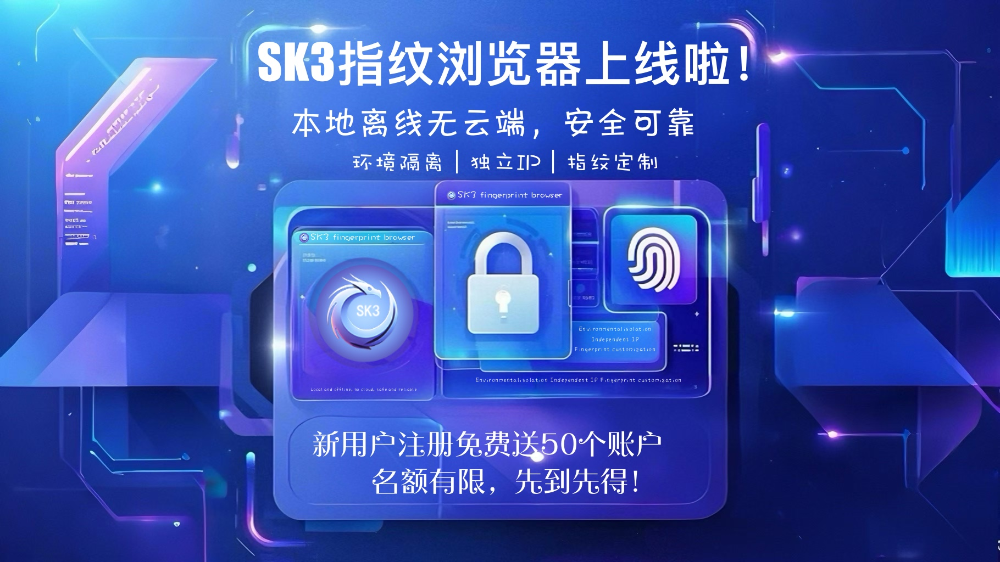
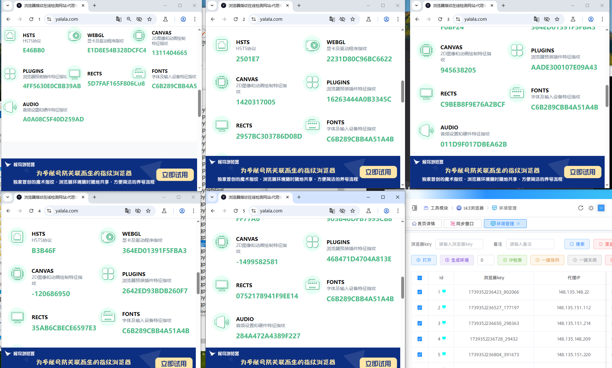
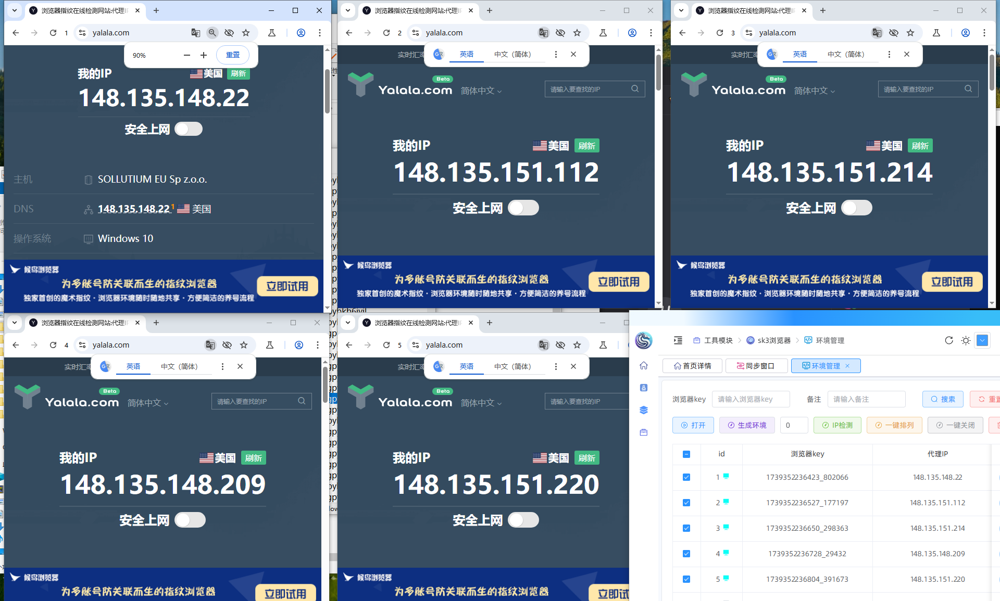

## 🔥 **SK3指纹浏览器多开防关联利器,注册即送50个窗口！**
---

本地离线无云端|安全可靠|环境隔离|独立IP|指纹定制

## 🌟 数据安全，作者亲自对接，浏览器无数据收集
▸▸撸个毛不容易，指纹浏览器被盗的消息层出不穷，大公司的数据被掌控在不同的人手中非常复杂，被盗了不知道纠谁的责任。 
指纹浏览器的功能是十分重要的，IP隔离和养号，如果用普通的多开会被5秒盾等检测，数量多了还是会风控的指纹浏览器
SK3指纹浏览器是按照市面上做指纹浏览器的标准定制的，环境隔离、独立IP、指纹定制，主要是作者一对一，无风险
数据都在本地安装目录，肉眼可见，可迁移，也有API文档(供开发者调用)

> 💡 **SK3核心革命性突破**：  
> `本地离线无云端`×`独立IP`×`指纹定制` × `环境隔离` = 您的数字身份金钟罩

      

可获取音频设置和硬件特征指纹

---

 

自定义指纹环境，http/socks5账密代理支持

---

## 🚨 **SK3六大优势**

🛡️ **绝对隐私王炸组合**  
▸ 100%离线运行｜零数据上传｜防盗防追踪  
▸ IP隔离技术｜丝滑切换  

💻 **多线程操作大师**  
▸ 无限窗口同步操作｜跨平台秒切换  
▸ 环境隔离|独立IP|指纹定制

📈 **养号神器全覆盖**  
▸ DC/推特/TG等主流平台完美适配  
▸ 推特、DC、TG养号神器

⚙️ **开发者友好型设计**  
▸ 可对接注册机｜打造专属自动化系统  

🔋 **高性能保障**  
▸7*24小时技术支持 、支持功能定制

🌍 **WEB3专用浏览器选手**  
▸ 支持代理账密socks5 \ http  协议

## 🚀 SK3指纹浏览器GitHub下载指南
🔥 GitHub：[https://github.com/Dear-Jn/Sk3browser](https://github.com/Dear-Jn/Sk3browser)  

---
 
 <ImageCard
        image="http://localhost:8080/Stable-kit-3/img/bro.png"
        title="SK3browser"
        description=""
        author="SK3"
        date="2025/01"
      />
          

SK3browser使用内核133

---

